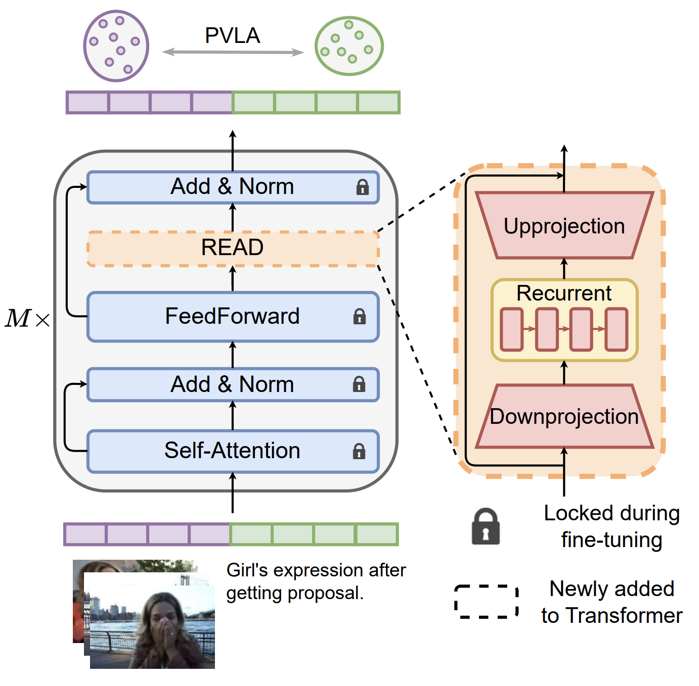

# READ: Recurrent Adapter with Partial Video-Language Alignment for Parameter-Efficient Transfer Learning in Low-Resource Video-Language Modeling
<a href="https://nguyentthong.github.io/READ/" target="_blank"></a>
<a href="https://arxiv.org/abs/2312.06950" target="_blank"></a>

This repository consists of the implementation of the [AAAI 2024](https://arxiv.org/abs/2312.06950) paper.



In this work, we propose a novel REcurrent ADapter (READ) that employs recurrent computation to facilitate temporal modeling capability for parameter-efficient adapters. To further enhance our READ modules, we propose Partial Video-Language Alignment (PVLA) objective via the use of partial optimal transport to maintain task-related information to flow into these modules. Extensive experiments validate the effectiveness of our READ framework on multiple low-resource temporal language grounding and video-language summarization benchmarks.

```
@article{nguyen2023read,
  title={READ: Recurrent Adapter with Partial Video-Language Alignment for Parameter-Efficient Transfer Learning in Low-Resource Video-Language Modeling},
  author={Nguyen, Thong and Wu, Xiaobao and Dong, Xinshuai and Le, Khoi and Hu, Zhiyuan and Nguyen, Cong-Duy and Ng, See-Kiong and Tuan, Luu Anh},
  journal={arXiv preprint arXiv:2312.06950},
  year={2023}
}
```

## Requirements
```
scikit-learn ≥ 1.0
torch ≥ 1.11
torchtext ≥ 0.12
torchvision ≥ 0.12
nncore ≥ 0.3.6
transformers == 4.3.2
pytorch-lightning == 1.2.4
torch == 1.8.0
datasets == 1.3.0
packaging == 21.3
nltk == 3.8.1
rouge-score == 0.1.2
```

## How to Run
### 1. Prepare the Data
Download the data at [the link](https://nusu-my.sharepoint.com/:f:/g/personal/e0998147_u_nus_edu/ElFzz8O_vM5Okm0UZNg19gkBVYLDnPXruaJ6nmCv0eSyHA) and unzip them in the `./data` folder.

Account: readpvla@gmail.com
Password: 53CQuejcIUIdqR9

### 2. Temporal Language Grounding
##### a) Train the model

We provide a shell script under `./TLG` to train the model:
```
bash ./train.sh
```
##### b) Test the model
We provide a shell script under `./TLG` to test the model:
```
bash ./test.sh
```

### 3. Video-Language Summarization
##### a) Train the model

We provide a shell script under `./VLS/scripts` to train the model:
```
bash ./scripts/train.sh
```

##### b) Test the model
We provide a shell script under `./VLS/scripts` to train the model:
```
bash ./scripts/test.sh
```
